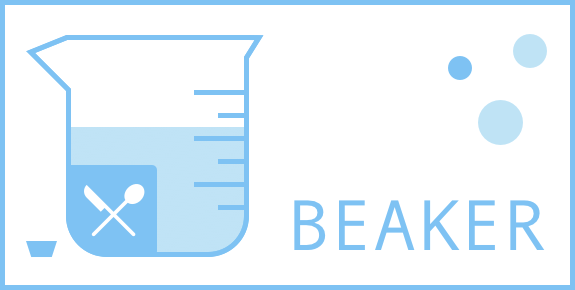

# Beaker

Beaker（烧杯）是一个量化日常饮食的小工具，同时也是缩写词（有点硬）：
> Build Eating And Keep Eating Reasonable.

## 背景
我两年的健身经历告诉我，无论是增肌还是减脂，最重要的事情是量化；而量化的重中之重是**饮食量化**。

## 理念
Beaker 目前只是我个人使用的一个小工具，定制化很强（结构化数据是根据我的饮食习惯而来），主要特点：

- 直观：采用 NRV% 而非 calorie。采用 NRV 的原因是：基础代谢和日常消耗的总和，通常与 NRV 推荐值（2000Kcal）很契合，这种情况下如果还要坚持使用卡路里就毫无道理了。
- 量化：尽可能选择有热量标识的有限食物。Less is more. 只有足够少的选择，才能做到足够的精确。所以在饮食量化期间，选择有限的食物，以及能够量化的食物，将会让效果更佳理想。
- 省心：免去日常统计和筛选的烦恼。每天晚上睡觉前计划好第二天的饮食计划，导出后作为第二天的 todo list，供第二天购买和食用。如果能够在计划时预留一些意外摄入，会让量化更佳的灵活。

## 使用
整体采用 Plan 的形式，因此 Beaker 不存储任何数据和状态，即用即走。
(todo)

## Next
- 根据增肌需要考虑蛋白质摄入维度的量化
